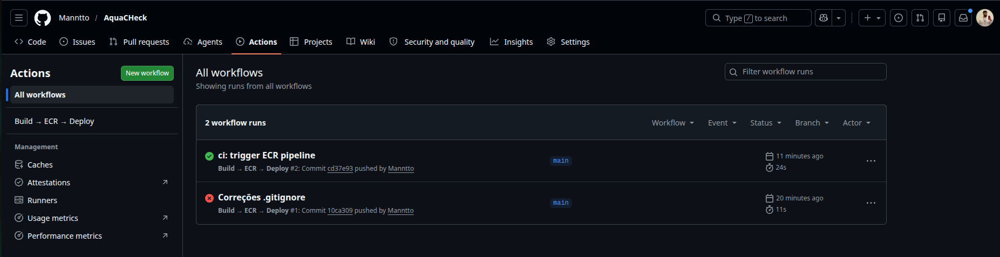
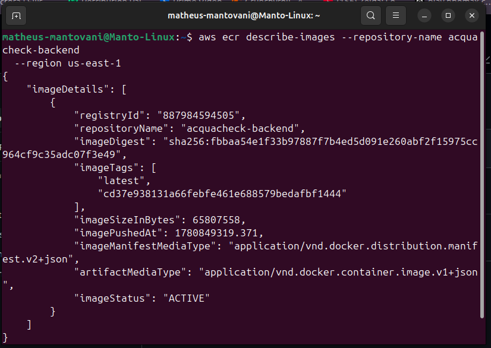

# AcquaCheck

Sistema de inspeção de atrações aquáticas. Inspetores realizam checklists de conformidade em atrações (toboáguas, piscinas, etc.), respondendo perguntas específicas de cada atração.

**Caminho Escolhido:** Opção A — Docker / Orquestração Local

---

## Entidades, tabelas e relacionamentos

| Model | Tabela | Descrição |
|---|---|---|
| User | `users` | Usuários do sistema (admin / inspector) |
| Attraction | `attractions` | Atrações aquáticas inspecionadas |
| Question | `questions` | Perguntas de inspeção vinculadas a uma atração |
| Checklist | `checklists` | Registro de uma inspeção (usuário + atração + data) |
| ItemChecklist | `checklist_items` | **Tabela pivô** — resposta de cada pergunta num checklist |

**Relação N:N:** `Checklist` ↔ `Question` via `checklist_items` (um checklist tem muitas perguntas; uma pergunta pode aparecer em muitos checklists).

---

## CRUD das entidades principais

Todas as rotas (exceto `POST /auth/login` e `POST /users`) exigem token JWT no header `Authorization: Bearer <token>`.

### Users — `/users`
| Método | Rota | Ação |
|---|---|---|
| GET | `/users` | Listar usuários |
| GET | `/users/:id` | Buscar por ID |
| POST | `/users` | Criar usuário (público) |
| PUT | `/users/:id` | Atualizar usuário |
| DELETE | `/users/:id` | Excluir usuário |

### Attractions — `/attractions`
| Método | Rota | Ação |
|---|---|---|
| GET | `/attractions` | Listar atrações |
| GET | `/attractions/:id` | Buscar por ID |
| POST | `/attractions` | Criar atração |
| PUT | `/attractions/:id` | Atualizar atração |
| DELETE | `/attractions/:id` | Excluir atração |

### Questions — `/questions`
| Método | Rota | Ação |
|---|---|---|
| GET | `/questions` | Listar perguntas |
| GET | `/questions/:id` | Buscar por ID |
| POST | `/questions` | Criar pergunta |
| PUT | `/questions/:id` | Atualizar pergunta |
| DELETE | `/questions/:id` | Excluir pergunta |

### Checklists — `/checklists`
| Método | Rota | Ação |
|---|---|---|
| GET | `/checklists` | Listar checklists |
| GET | `/checklists/:id` | Buscar por ID |
| POST | `/checklists` | Criar checklist |
| PUT | `/checklists/:id` | Atualizar checklist |
| DELETE | `/checklists/:id` | Excluir checklist |

### Items (tabela pivô) — `/items`
| Método | Rota | Ação |
|---|---|---|
| GET | `/items/checklist/:checklistId` | Listar itens de um checklist |
| GET | `/items/:id` | Buscar item por ID |
| POST | `/items` | Criar item |
| PUT | `/items/:id` | Atualizar item |
| DELETE | `/items/:id` | Excluir item |

---

## Containers

| Serviço | Imagem | Função |
|---|---|---|
| `db` | `postgres:17-alpine` | Banco de dados PostgreSQL |
| `redis` | `redis:7-alpine` | Cache (Redis) |
| `backend` | Build local (`node:24-alpine`) | API Node.js / Express |
| `nginx` | `nginx:1.27-alpine` | Proxy reverso (porta 80) |

Arquitetura: `Host → Nginx (80) → backend:3000 → db:5432`

O backend **não expõe porta diretamente** ao host — todo acesso externo passa pelo Nginx.

---

## Bibliotecas utilizadas

| Pacote | Uso |
|---|---|
| `express` | Servidor HTTP |
| `sequelize` + `pg` | ORM + driver PostgreSQL |
| `bcryptjs` | Hash de senhas |
| `jsonwebtoken` | Geração e verificação de JWT |
| `dotenv` | Variáveis de ambiente |
| `cors` | Política de CORS |
| `helmet` | Headers de segurança |
| `swagger-jsdoc` + `swagger-ui-express` | Documentação Swagger |
| `nodemon` | Hot-reload em desenvolvimento |

---

## Pré-requisitos

Ferramentas necessárias (WSL2 ou Linux):

- Docker Engine 24+ ou Docker Desktop com WSL2 backend
- Docker Compose Plugin (`docker compose` — sem hífen)
- Git

```bash
docker --version
docker compose version
```

---

## Como executar com Docker

```bash
# 1. Clone o repositório
git clone <url-do-repo>
cd AcquaCheckPROVA

# 2. Configure as variáveis de ambiente
cp backend/.env.example backend/.env
# Edite backend/.env com suas credenciais

# 3. Suba todos os containers
docker compose up --build -d

# 4. Execute as migrations
docker compose exec backend node command.js migrate

# A API estará disponível em http://localhost
```

---

## Gestão de Segredos e Configurações

Crie o arquivo `backend/.env` com base no exemplo abaixo. **Nunca commite senhas reais.**

```env
POSTGRES_DB=banco_checklist
POSTGRES_USER=admin
POSTGRES_PASSWORD=sua_senha_aqui
JWT_SECRET=seu_segredo_jwt_aqui
DB_HOST=db
CORS_ORIGIN=http://localhost:5173
```

> ⚠️ O arquivo `.env` já está no `.gitignore` — nunca commite credenciais reais.

---

## Como executar as migrations

```bash
# Dentro do container backend (após docker compose up)
docker compose exec backend node command.js migrate

# Ou localmente (com banco acessível em localhost)
cd backend
node command.js migrate        # sincroniza tabelas (ALTER)
node command.js migrate:fresh  # recria todas as tabelas (DROP + CREATE)
```

---

## Login e uso do token JWT

**1. Criar um usuário:**
```bash
curl -X POST http://localhost/users \
  -H "Content-Type: application/json" \
  -d '{"name":"Admin","email":"admin@acquacheck.com","password":"123456","role":"admin"}'
```

**2. Fazer login:**
```bash
curl -X POST http://localhost/auth/login \
  -H "Content-Type: application/json" \
  -d '{"email":"admin@acquacheck.com","password":"123456"}'
# Resposta: { "token": "eyJ..." }
```

**3. Usar o token nas demais rotas:**
```bash
curl http://localhost/attractions \
  -H "Authorization: Bearer eyJ..."
```

---

## Documentação Swagger

Acesse após subir os containers:

```
http://localhost/api-docs
```

---

## Detalhamento Técnico da Infraestrutura

### Otimização de Imagens (Multi-stage Build)

O `backend/Dockerfile` usa dois estágios:

```
Stage 1 — deps (node:24-alpine)
  └── Copia package*.json e executa npm ci --omit=dev
      (camada menos mutável → cache reutilizado em rebuilds)

Stage 2 — runtime (node:24-alpine)
  └── Copia node_modules prontos do stage 1
  └── Copia o código-fonte por último (camada mais mutável)
```

O `.dockerignore` exclui `node_modules/`, `.env`, `.git` e logs — reduz o contexto de build enviado ao daemon.

### Persistência de Dados (Named Volumes)

| Volume | Serviço | Dado persistido |
|---|---|---|
| `postgres_data` | `db` | Banco PostgreSQL completo |
| `redis_data` | `redis` | Cache Redis |

Named Volumes sobrevivem a `docker compose down` e restart. Bind mounts não são usados para dados persistentes.

### Rede e Comunicação Interna (Custom Bridge)

Todos os serviços estão na rede `acquacheckprova_internal` (tipo `bridge`). A comunicação ocorre por **nome de serviço** via DNS interno do Docker — IPs estáticos não são usados.

```
Host :80
  └── nginx  →  proxy_pass http://backend:3000
                  └── backend  →  host=db:5432
                  └── backend  →  host=redis:6379
```

`db` e `redis` não têm portas mapeadas para o host — inacessíveis diretamente da internet.

### Segurança

- Credenciais injetadas via `.env` — nunca hardcoded
- Backend sem porta exposta ao host (`PortBindings: {}`)
- Banco e Redis acessíveis apenas dentro da rede `internal`
- Imagem imutável — nenhuma alteração em runtime no filesystem do container

---

## Evidências de Funcionamento e Verificação

```bash
# Containers em execução
docker compose ps

# Volumes persistentes
docker volume ls | grep acquacheck

# DNS interno (Service Discovery)
docker network inspect acquacheckprova_internal \
  --format '{{range .Containers}}{{.Name}}: {{.IPv4Address}}{{"\n"}}{{end}}'

# Confirmar que backend não tem porta exposta ao host
docker inspect acquacheck_backend \
  --format '{{json .HostConfig.PortBindings}}'
# Saída esperada: {}

# Logs da API
docker compose logs backend

# Logs do Nginx
docker compose logs nginx
```

**URL de acesso:** `http://localhost`  
**Swagger:** `http://localhost/api-docs`

---

## Troubleshooting e Limpeza

**Problemas comuns:**
- `Connection refused` no backend → aguarde o postgres inicializar (~5s): `docker compose logs db`
- Porta 80 ocupada → altere `"80:80"` para `"8080:80"` no `docker-compose.yml`
- Volume com dados de versão incompatível → `docker compose down -v && docker compose up --build -d`

```bash
# Para e remove containers (mantém volumes)
docker compose down

# Remove também os volumes (apaga dados do banco)
docker compose down -v
```

---

## CI/CD — Build, Tag e Push para Amazon ECR

O pipeline `.github/workflows/deploy.yml` automatiza o ciclo a cada push na branch `main`:

1. **Build** — `docker build` usando o Dockerfile multi-stage do backend
2. **Tag** — duas tags: `latest` e o SHA do commit (rastreabilidade)
3. **ECR Push** — `docker push` para o registro privado da AWS
4. **Deploy** — atualização do serviço ECS/Swarm com a nova imagem

Credenciais AWS configuradas via **GitHub Secrets** (`AWS_ACCESS_KEY_ID`, `AWS_SECRET_ACCESS_KEY`) — sem chaves fixas no código.

### Evidência de Execução do Pipeline

Pipeline executado com sucesso em: https://github.com/Manntto/AquaCHeck/actions

Imagem publicada no ECR com duas tags (rastreabilidade):

```json
{
    "repositoryName": "acquacheck-backend",
    "imageTags": [
        "latest",
        "cd37e938131a66febfe461e688579bedafbf1444"
    ],
    "imageSizeInBytes": 65807558,
    "imageStatus": "ACTIVE"
}
```

Verificação via CLI:
```bash
aws ecr describe-images --repository-name acquacheck-backend --region us-east-1
```




```bash
# Fluxo manual equivalente:
aws ecr get-login-password --region us-east-1 \
  | docker login --username AWS \
    --password-stdin <ACCOUNT_ID>.dkr.ecr.us-east-1.amazonaws.com

docker build -t acquacheck-backend ./backend
docker tag acquacheck-backend:latest \
  <ACCOUNT_ID>.dkr.ecr.us-east-1.amazonaws.com/acquacheck-backend:latest
docker push \
  <ACCOUNT_ID>.dkr.ecr.us-east-1.amazonaws.com/acquacheck-backend:latest
```
